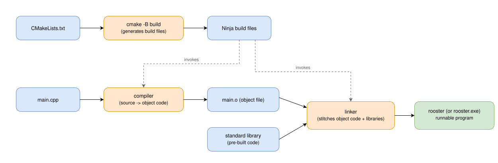

<!-- _class: lead -->

# CMake: The Ground Beneath the Code

## What actually happens between main.cpp and a running program

---

*Why this matters*

## Every lecture in this course has one of these

```cmake
cmake_minimum_required(VERSION 3.20)
project(rooster)
set(CMAKE_CXX_STANDARD 23)
set(CMAKE_CXX_STANDARD_REQUIRED ON)
add_executable(rooster main.cpp)
```

You've been running `cmake -B build` and `cmake --build build` since
lecture 2.2 without asking what they actually do. This lecture answers
that.

---

*What CMake is not*

## CMake doesn't compile your code

CMake is a **build system generator**. It never touches the compiler
directly - it reads `CMakeLists.txt` and *generates* input files for a
separate build tool (in this course, **Ninja**), which is the thing that
actually invokes the compiler and linker.

```text
CMakeLists.txt  --[cmake]-->  Ninja build files  --[ninja]-->  ...
```

---

*The full pipeline*

## Source code to runnable program



---

*Step 1: configure*

## cmake -B build

```sh
cmake -B build -G Ninja .
```

Reads `CMakeLists.txt` and **generates** the Ninja build files inside a
new `build/` folder. This step doesn't compile anything - it works out
*what* needs to be compiled, in what order, with what flags, and writes
that plan down.

---

*Step 2: build*

## cmake --build build

```sh
cmake --build build
```

Runs Ninja against the plan generated in step 1. Ninja itself invokes two
different programs, in order, for every source file:

1. the **compiler**
2. the **linker**

---

*The compiler's job*

## Source code -> object code

The compiler reads one `.cpp` file at a time and translates it into
**object code** - machine instructions specific to your CPU, but not yet
a runnable program. On disk, this is a `.o` file (`.obj` on Windows).

```text
main.cpp  --[compiler]-->  main.o
```

A compiler error (a typo, a missing `;`) happens at this step - your code
never even reaches the linker.

---

*The linker's job*

## Object code -> a runnable program

The **linker** takes your object file(s) and combines them with the
**standard library** (pre-compiled code for things like `std::println`,
`std::vector`, `std::string`) to produce one executable.

```text
main.o + standard library  --[linker]-->  rooster (or rooster.exe)
```

A "linker error" (`undefined reference`) means the compiler understood
your code fine, but something it needed wasn't found at this step.

---

*Where the name comes from*

## rooster

Every `CMakeLists.txt` in this course names its executable `rooster` via
`add_executable(rooster main.cpp)` - that's why `./build/rooster` (or
`build\rooster.exe` on Windows) is the program you run after every build,
regardless of which lecture you're in.

---

*Same file, three tools*

## This is what Visual Studio and Qt Creator do for you

Neither IDE has its own separate compilation model in this course - both
read this exact same `CMakeLists.txt`, and both are really just running
`cmake -B build` / `cmake --build build` behind a Run/Debug button.
Docker (2.7) runs the identical two commands by hand, inside a
container. One build description, three ways to trigger it.
