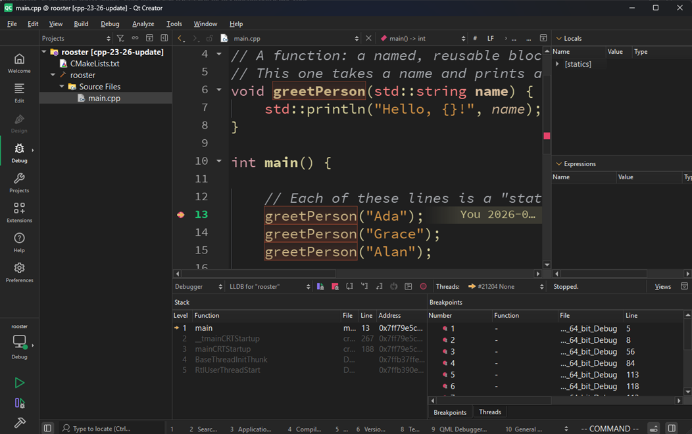

<!-- _class: lead -->

# Statements and Functions

## Building blocks

---

*Statements*

## Statements

Each instruction we give the computer is a **statement** - executed top
to bottom, one after another.

```cpp
int age { 42 }; // a statement that declares a variable and initializes it
greetPerson("Grace"); // a statement that calls a function
return 0; // a statement that ends the program
```

---

*Functions*

## A function

A named, reusable block of statements - write the logic once, call it
as many times as you like.

```cpp
void greetPerson(std::string name) {
    std::println("Hello, {}!", name);
}
```

`name` is a **parameter** - a placeholder filled in by whoever calls it.

---


*Two kinds of errors*

## Compile-time vs. runtime

<div class="cols">
<div>

**Compile-time error**
The program won't even build.

```cpp
greetPersonn("Ada");
// typo: no such function
```

</div>
<div>

**Runtime error**
It builds, but breaks while running.

```cpp
int trouble = numerator / 0;
// compiles fine, crashes when run
```

</div>
</div>

---

*Debugging habit*

## Start the debugging habit now

<div class="callout">Breakpoint inside <code>greetPerson</code> and inspect <code>name</code> - get comfortable doing this <strong>before</strong> things get complicated.</div>

