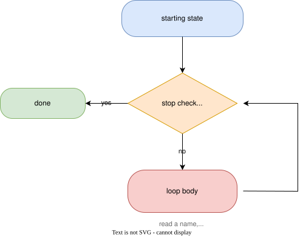
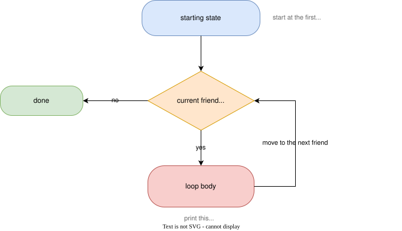

<!-- _class: lead -->

# Doing It Many Times

## Loops and your first collection

---

# What We are After

## Collecting a list of friends

- We tell the user to type in a friend's name.
- We keep asking until they hit enter on an empty line.
- If they type in a name, we add it to a list of friends.
- If they hit enter on an empty line, we stop asking and print the list of friends.

---

*Dissecting a while loop*



---

*while*

## while - repeat until told to stop

```cpp
while (true) {
    std::print("Friend's name: ");
    std::string friendName;
    std::getline(std::cin, friendName);

    if (friendName.empty()) {
        break; // empty line means we're done
    }

    friends.push_back(friendName);
}
```

---

*break*

## break

`break` exits a loop immediately, regardless of the loop's condition.

```cpp
if (friendName.empty()) {
    break;
}
```

Without it, `while (true)` would never stop on its own.

---

*A collection, ready-made*

## You don't have to build one

C++ ships with ready-made collections - you don't have to build your own growable list.

```cpp
std::vector<std::string> friends;
```

`std::vector<std::string>` is a list of strings that **grows** as you add to it with `push_back`.

<div class="callout">Same idea as <code>std::string</code> being a ready-made collection of characters. You don't need to know how <code>std::vector</code> works inside to use one.</div>

---

*Dissecting a for loop*



---

*Looping over it*

## Looping over the collection

```cpp
std::println("\nYou added {} friend(s):", friends.size());
for (const std::string& friendName : friends) {
    std::println(" - {}", friendName);
}
```

A range-based `for` visits every element, one at a time - no manual
indexing required. It's another variant of loops in C++.

---

*Debug the collection*

## Watch it grow, one push_back at a time

Step into the loop and open your IDE's variable/locals view - watching
`friends` gain an element on each iteration is the clearest way to see
a `std::vector` actually grow.